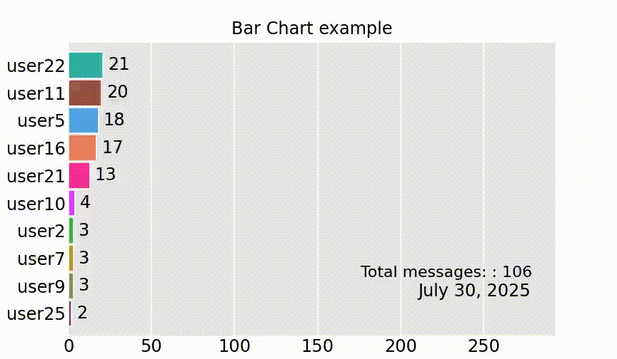

# Analisador de Mensagens WhatsApp (Alpha)

Uma ferramenta Python para analisar e visualizar exportações de conversas do WhatsApp, com processamento de dados interativo e geração de gráficos de barras animados.

## Instalação

### Pré-requisitos

- Python 3.10 ou superior
- Dependências necessárias (instale via pip ou uv):

```bash
pip install -r requirements.txt
```

## Uso

### Uso Básico

Execute o analisador com prompts interativos:

```bash
python main.py
```

### Opções de Linha de Comando

```bash
python main.py [OPÇÕES]
```

#### Opções

| Opção | Abrev. | Descrição | Exemplo |
|-------|--------|-----------|---------|
| `--name` | `-n` | Nome do projeto para arquivos de saída | `-n "Chat Família"` |
| `--data` | `-d` | Caminho para o arquivo de exportação do WhatsApp | `-d "chat.txt"` |
| `--config` | `-c` | Caminho para o arquivo de configuração YAML | `-c "config.yaml"` |
| `--map` | `-m` | Caminho para o arquivo YAML de mapeamento de nomes | `-m "nomes.yaml"` |
| `--start-date` | `-sd` | Data de início para análise (YYYY-MM-DD) | `-sd 2023-01-01` |
| `--period` | `-p` | Filtro de período de tempo | `-p 6m`, `-p 1y`, `-p 30d` |
| `--video` | `-v` | Gerar vídeo de corrida de gráfico de barras | `-v` |
| `--anon` | | Anonimizar nomes na saída | `--anon` |
| `--verbose` | | Habilitar logging detalhado | `--verbose` |
| `--help` | `-h` | Mostrar mensagem de ajuda | `-h` |

### Exemplos

#### Analisar últimos 6 meses com geração de vídeo:
```bash
python main.py -n "meu_chat" -d "Chat do WhatsApp.txt"
```

## Configuração

### Arquivo de Configuração Padrão

A ferramenta espera um arquivo de configuração padrão em `configs/default_config.yaml`. Este arquivo deve conter configurações para:

- Estilo e cores dos gráficos
- Formatos e caminhos de saída
- Parâmetros de processamento de dados
- Configurações de visualização

### Arquivo de Mapeamento de Nomes

Crie um arquivo YAML para mapear números de telefone para nomes legíveis:

```yaml
replace_dict:
  "+5511987654321": "João Silva"
  "+5511123456789": "Maria Santos"
  "Contato Desconhecido": "Pessoa Misteriosa"
```

## Formato de Período de Tempo

A opção `--period` aceita os seguintes formatos:

- `Xd` - X dias (ex: `30d` para 30 dias)
- `Xm` - X meses (ex: `6m` para 6 meses)
- `Xy` - X anos (ex: `1y` para 1 ano)

## Estrutura do Projeto

```
whatsapp-analyzer/
├── main.py                 # Aplicação CLI principal
├── read_data.py            # Funcionalidade de leitura de dados
├── etl.py                  # Pipeline de transformação de dados
├── dataviz.py              # Geração de visualizações
├── utils.py                # Funções utilitárias
├── configs/                # Arquivos de configuração
│   ├── default_config.yaml # Configuração geral
│   └── map_contacts.yaml   # Arquivo de Mapeamento de Nomes
└── README.md
```

## Saída

A ferramenta gera:

1. **Dados Processados**: Dados de mensagens limpos e transformados
2. **Estatísticas**: Contagem de mensagens, padrões de atividade, análise de participantes
3. **Vídeo de Corrida de Gráfico de Barras**: Visualização animada mostrando atividade de mensagens ao longo do tempo (opcional)



## Formato de Exportação do WhatsApp

Para exportar sua conversa do WhatsApp:

1. *No seu celular:* Abra a conversa no WhatsApp
2. Toque no nome do contato/grupo no topo
3. Role para baixo e toque em "Exportar conversa"
4. Escolha "Sem mídia" para processamento mais rápido
5. Salve o arquivo `.txt` e use-o com esta ferramenta


## Privacidade e Segurança

- A ferramenta processa dados localmente na sua máquina
- Nenhum dado é transmitido para serviços externos
- Use a flag `--anon` para anonimizar nomes de participantes se precisar compartilhar
- Arquivos de mapeamento de nomes podem ajudar a manter privacidade enquanto mantém a análise significativa

## Solução de Problemas

### Problemas Comuns

**Não é possível exportar histórico de conversa**: se o grupo do WhatsApp tiver habilitado a opção 'Privacidade avançada de chat'. Você não conseguirá exportar o histórico de conversas.

**"Faltando a chave: 'replace_dict'"**: Seu arquivo de mapeamento deve conter uma chave `replace_dict` no nível superior.

## Contribuindo

1. Faça um fork do repositório
2. Crie uma branch de feature
3. Faça suas alterações
4. Adicione testes se aplicável
5. Envie um pull request

## Suporte

Para problemas e perguntas, por favor [crie uma issue](link-to-issues) no repositório.

## Agradecimentos
- Usando o gráfico de corrida de barras de [dexplo/bar_chart_race](https://github.com/dexplo/bar_chart_race)